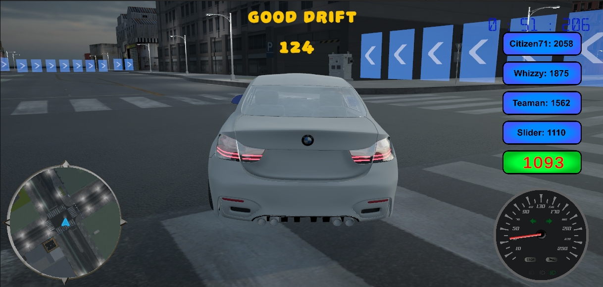
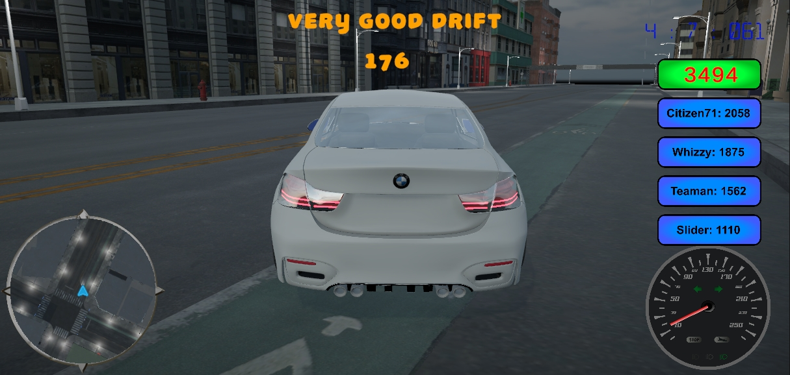
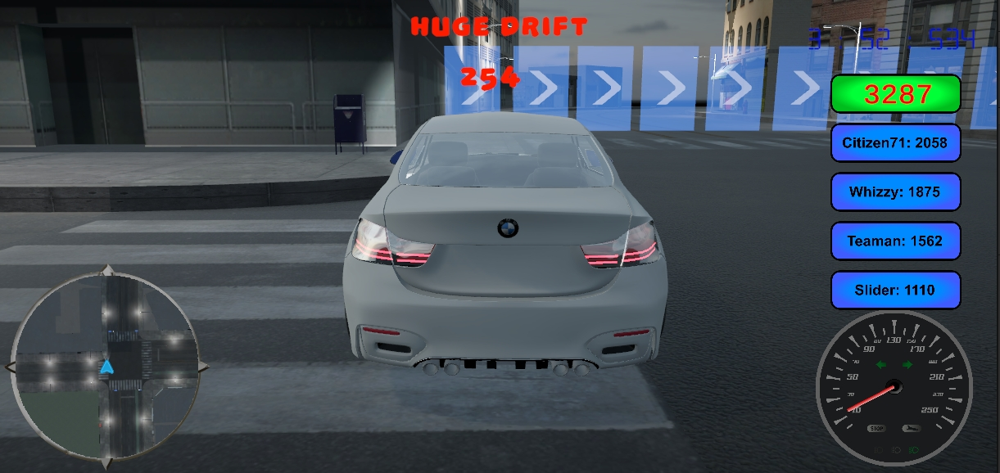

# DriftRacer

A drift racing game made with Unity with two levels. The target platform is desktop systems.

## Building requirements
- Unity Version: 2022.3.x
- Blender (at least version 5.0)

Visual Studio is recommended. 

## Running the game

A built version of the game is in the "build" folder. 

## Gameplay

There are two levels in this game. The first is a racing track, the other a city. 

The car can be controlled with the arrow keys and the space key is the handbrake. Hitting the "1" key shifts to the normal view, while the "2" switches to the view in the front of the car. 

## Screenshots

